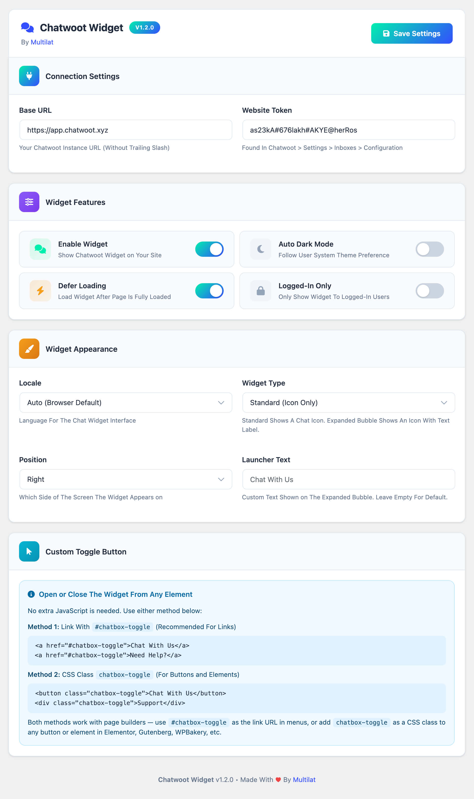

# Chatwoot Widget For WordPress — By Multilat

A lightweight WordPress plugin that adds the
[Chatwoot](https://chatwoot.com) live chat widget to your
site with deferred loading, dark mode, locale selection,
custom toggle button support, and a modern admin interface.



**Compatible With**: WordPress 5.0+ and Chatwoot 4.x+

## Features

### Widget Controls

- **Enable/Disable Widget**: Master on/off switch
- **Auto Dark Mode**: Widget follows user system theme
  preference
- **Defer Loading**: Loads widget after page is fully loaded
  for better performance
- **Logged-In Only**: Restrict widget to authenticated
  WordPress users only

### Widget Appearance

- **Locale**: Choose from 15 languages or auto-detect
  from browser
- **Widget Type**: Standard icon or expanded bubble with
  text label
- **Position**: Left or right side of the screen
- **Launcher Text**: Custom text for the expanded bubble

### Custom Toggle Button

Open or close the chat widget from any element on your
site — no JavaScript required:

- **Link Method**: Use `#chatbox-toggle` as the URL
  (`<a href="#chatbox-toggle">Chat With Us</a>`)
- **Class Method**: Add the `chatbox-toggle` CSS class
  to any element
- Works with all page builders (Elementor, Gutenberg,
  WPBakery, etc.)

### Admin Interface

- Modern card-based settings page
- Visual feature toggles with color-coded icons
- Responsive layout for all screen sizes
- One-click save from the header

## Requirements

- WordPress 5.0 or higher
- A Chatwoot instance (self-hosted or cloud)
- Website token from your Chatwoot inbox

## Install

### Option A: Upload ZIP

1. Download `chatwoot-widget.zip` from the
   [latest release](https://github.com/multilat/multilat-chatwoot-wordpress-plugin/releases/latest)
2. Go to **WordPress Admin > Plugins > Add New > Upload Plugin**
3. Upload the zip and click **Install Now**
4. Click **Activate**

### Option B: Manual Upload

1. Download and extract the release zip
2. Upload `chatwoot-widget.php` to your
   `wp-content/plugins/` directory
3. Go to **Plugins** and activate **Chatwoot Widget By Multilat**

### Option C: Git Clone

```bash
cd /path/to/wordpress/wp-content/plugins/
git clone https://github.com/multilat/multilat-chatwoot-wordpress-plugin.git
```

## Configure

Go to **Settings > Chatwoot Widget**:

### 1. Connection Settings

- **Base URL**: Your Chatwoot instance URL
  (e.g., `https://chat.example.com`) — without trailing slash
- **Website Token**: Found in Chatwoot under
  Settings > Inboxes > Your Web Widget > Configuration

### 2. Widget Features

Toggle the features you need:

- **Enable Widget**: Turn the chat widget on or off
- **Auto Dark Mode**: Widget adapts to light/dark system
  preference
- **Defer Loading**: Loads the Chatwoot SDK after the page
  is fully loaded (recommended for performance)
- **Logged-In Only**: Only show the widget to logged-in
  WordPress users

### 3. Widget Appearance

- **Locale**: Set the widget language or leave as auto
  to detect from browser
- **Widget Type**: Choose between standard (icon only)
  or expanded bubble (icon + text)
- **Position**: Place the widget on the left or right
  side of the screen
- **Launcher Text**: Custom text displayed on the expanded
  bubble (e.g., "Chat With Us")

### 4. Custom Toggle Button (Optional)

Add a chat toggle to any page element:

```html
<!-- Link Method -->
<a href="#chatbox-toggle">Chat With Us</a>

<!-- Class Method -->
<button class="chatbox-toggle">Need Help?</button>
```

## Update

1. Download the new release zip
2. Go to **Plugins > Add New > Upload Plugin**
3. Upload the zip and WordPress will prompt to replace
   the existing version
4. Click **Replace Current With Uploaded**

## Uninstall

1. Go to **WordPress Admin > Plugins**
2. Deactivate **Chatwoot Widget By Multilat**
3. Click **Delete** to remove the plugin files

Plugin settings are stored in the `wp_options` table
under the key `chatwoot_widget_settings` and will be
removed when the plugin is deleted.

## File Structure

```text
multilat-chatwoot-wordpress-plugin/
├── chatwoot-widget.php    # Single-file plugin
├── LICENSE
└── README.md
```

## License

This project is licensed under the
[GPL-2.0-or-later](LICENSE).

## Developer

**Multilat** - Digital Services and Solutions

- Website: [multilat.xyz](https://multilat.xyz)
- Contact: [multilat.xyz/contact](https://multilat.xyz/contact)
- Email: [hello@multilat.xyz](mailto:hello@multilat.xyz)
